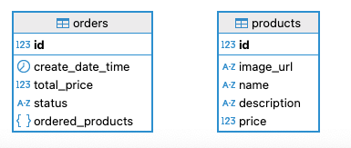

# myShop v2
## Техническое задание 
Приложение состоит из шести основных частей (модулей):
- страница витрины товаров, доступных для просмотра и покупки;
    - список товаров, доступных для заказа (картинка, название, цена, кнопка добавления в корзину/удаления из неё, кнопка изменения количества товара в корзине);
    - список товаров может быть представлен в любом виде (списком, плиткой);
    - есть пагинация (по 10, 20, 50, 100 товаров);
    - сверху строка поиска с фильтрацией по названию (можно просто по вхождению слова в название/описание товара);
    - сверху доступна фильтрация по цене, алфавиту
- страница товара;
    - название, картинка, описание товара, возможность положить товар в корзину/удалить его, изменить количество в корзине;
    - цена товара.
- страница корзины покупателя;
    - веб-страницу со списком положенных в неё товаров, их количеством, ценой каждого товара и общей ценой всей корзины;
    - есть возможность удалить товар из корзины, изменить его количество;
    - есть кнопка оформления заказа.
        - При нажатии на кнопку оформления заказа происходит эмуляция оформления заказа, при этом происходит переход на страницу оформленного заказа.
- страница всех заказов;
    - страницу со списком всех оформленных заказов, суммой каждого заказа и общей суммой всех заказов;
    - при нажатии на заказ появляется веб-страница совершённого заказа.
- страница заказа;
    - На веб-странице заказа представлен список купленных товаров (картинка, название, цена).
- сервис покупки.

## Основные эндпоинты 
| Эндпоинт                           | Описание                              | 
|------------------------------------|---------------------------------------|
| http://localhost:8080              | Витрина товаров                       | 
| http://localhost:8080/order/basket | Корзина с товарами                    | 
| http://localhost:8080/order/orders | Оплаченные заказы                     |
| http://localhost:8080/order/{id}   | Открыть страницу с оплаченным заказом |


## Особенности реализации 
- Реализовано на реактивном стеке
- Корзина - это Order в статусе PRE_ORDER
- При оформлении заказа из корзины, корзина приобретает статус PAID (становится оплаченным заказом) и создается новая корзина
- Когда у товара стоит цифра 0, значит товара нет в корзине
- Кнопками + и - можно добавлять и убавлять товары в корзине соответственно
- На всех страницах есть плашка с кнопками (домой, корзина, оплаченные заказы)
- Для первичной загрузки товаров надо нажать ссылку ["Загрузить список товаров с нуля"](http://localhost:8080/createTestProducts) в левой верхней части страницы с [витриной товаров](http://localhost:8080)

## Схема БД 


## Алгоритм запуска приложения:
- Установить docker на компьютер
- Для клонирования прокта 
```
git clone https://github.com/MityuninDmitry/myShop.git
```
- перейти в директорию проекта
```
cd myShop
```
- Различные способы запуска на выбор:
  - Запуск полностью в докере:
    - Запуск 
    ```
    docker-compose up -d
    ```
    - Остановка 
    ```
    docker-compose down
    ```
  - Запуск из idea:
    - сперва поднять БД в докере
    ``` 
    docker-compose up -d postgres 
    ``` 
    - в переменные окружения добавить 
    ```
    SPRING_R2DBC_PASSWORD=springpass;SPRING_R2DBC_URL=r2dbc:postgresql://localhost:5432/myShop;SPRING_R2DBC_USERNAME=springuser;SPRING_DATASOURCE_URL=jdbc:postgresql://localhost:5432/myShop;SPRING_DATASOURCE_USERNAME=springuser;SPRING_DATASOURCE_PASSWORD=springpass;
    ```
    - нажать Run для запуска
    - остановка по Stop
  - запуск локально
    - сперва поднять БД в докере 
    ```
    docker-compose up -d postgres
    ```
    - ввести команду 
    ```
    ./mvnw spring-boot:run -Dspring-boot.run.jvmArguments="
    -DSPRING_R2DBC_URL=r2dbc:postgresql://localhost:5432/myShop
    -DSPRING_R2DBC_USERNAME=springuser
    -DSPRING_R2DBC_PASSWORD=springpass
    -DSPRING_DATASOURCE_URL=jdbc:postgresql://localhost:5432/myShop
    -DSPRING_DATASOURCE_USERNAME=springuser
    -DSPRING_DATASOURCE_PASSWORD=springpass
    "
    ```

## Тесты:
- для прогона тестов команда: ./mvnw test 

## Используемые технологии

- Spring Boot 
- WebFlux
- Docker
- PostgreSQL
- Liquibase
- Thymeleaf
- HTML/CSS
- Maven
- Junit